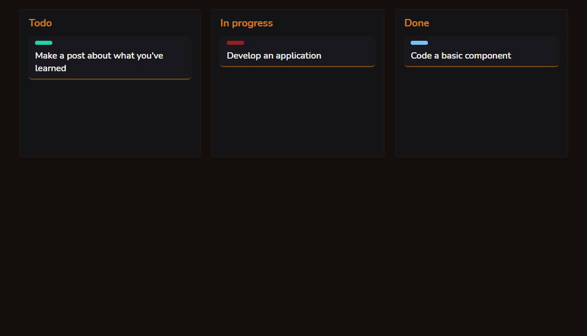

  

## Sobre o componente

  Inspirando-se na metodologia de gestão de tarefas Kanban, o componente em questão representa um protótipo de um quadro virtual deste tipo, o qual busca replicar, em relação à outros, a estrutura visual e a funcionalidade de drag and drop, trabalhando, portanto, com funções atreladas aos eventos de "dragstart", "dragend", "dragover" e "dragleave".

## README versions

  <a href="https://github.com/trybrito/handling-drag-and-drop-events/blob/main/README.md">
    Portuguese (pt-br)</a>
  |   
  <a href="https://github.com/trybrito/handling-drag-and-drop-events/blob/main/README-en.md">
    English (en-us)</a>

